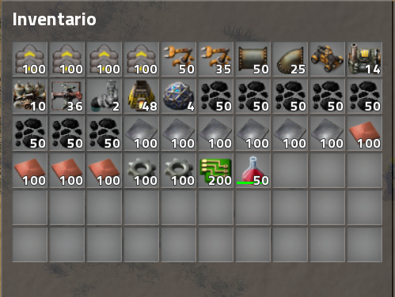
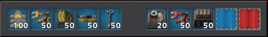

# Starter-Pack

A Factorio mod that makes you start with more items to accelerate the beginning of the game. Goal is to skip past burner miners and jump straight into laying out a main bus.

## Installation

To install the mod you have to download the .zip file and move it to the Factorio mods folder. For most people this will be inside the directory specified here: https://wiki.factorio.com/Application_directory#User_data_directory

Download: https://mods.factorio.com/mod/Starter_Pack

## Game Speed

To change te game speed, modify **line 2 of globals.lua**. (Default: 3)

## Resources
 
By having the mod active, the resources that come at the beginning are deleted and those of the image above are included.

## Quickbar

This is the quick bar by default, if you want to change the shortcut items you have to modify **filters.lua file**. Use the function set_filter to change the position and the resource that you want to define in the quickbar.

# What's next?
In the next version the following improvements will be included:

 > Kits (small - medium - large)

 When the game starts, the player can choose which type of starter pack he prefers.

 > Death Chest

When the player dies, he leaves in that location a chest with all the resources he had in his inventory.