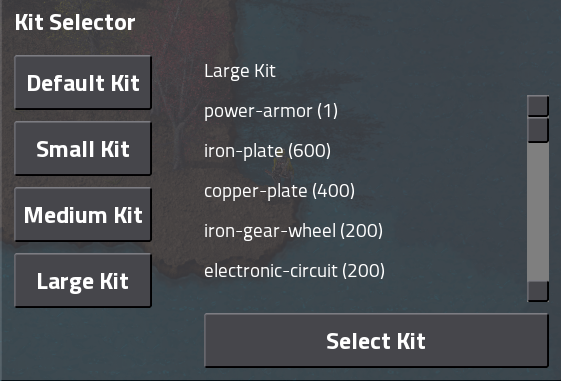
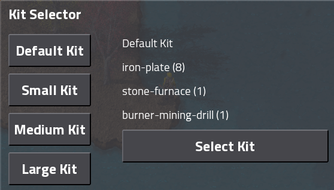

# Starter-Pack (v1.2.0)

A Factorio mod that makes you start with more items to accelerate the beginning of the game. Goal is to skip past burner miners and jump straight into laying out a main bus.

## Installation

To install the mod you have to download the .zip file and move it to the Factorio mods folder. For most people this will be inside the directory specified here: https://wiki.factorio.com/Application_directory#User_data_directory

Download: https://mods.factorio.com/mod/Starter_Pack

## Kits
When the game starts, the player can choose wich type of starter pack he prefers.

> Small Kit

> Medium Kit

> Large Kit

> Default Kit

## Game Speed
Also, the gui let the player change game speed.
